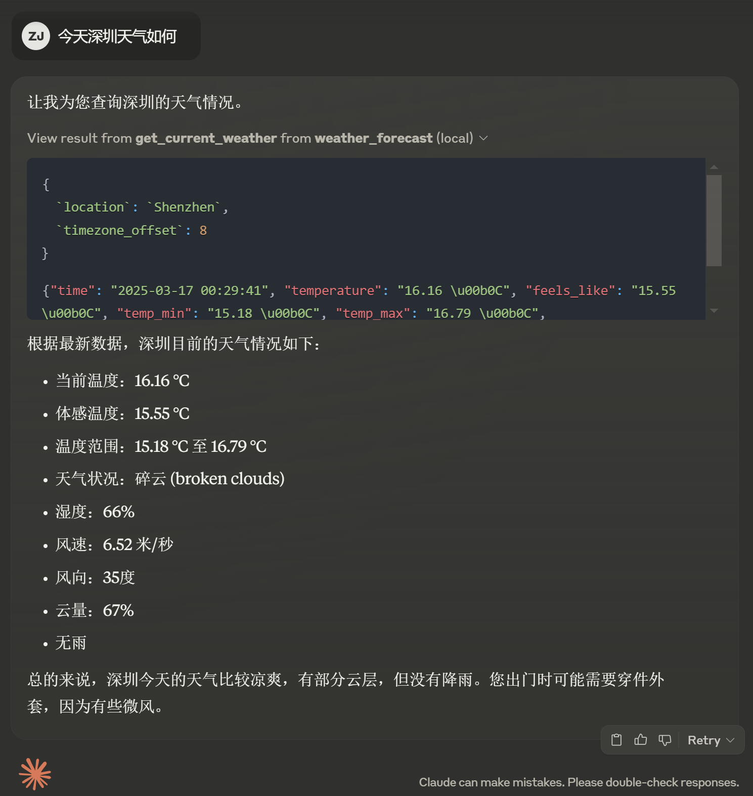

# Weekly Weather MCP Server

English | [中文版](README_CN.md)

A comprehensive weather forecast MCP (Model Control Protocol) server providing **8-day** global weather forecasts and current weather conditions using the OpenWeatherMap One Call API 3.0.

> This project is based on the original [Weather MCP](https://github.com/Zippland/weather-mcp) by Zippland, but has been substantially enhanced to support full week forecasts with detailed time-of-day data points.

<div align="center">
  
  <p><em>Screenshot of Claude Desktop using the MCP Weather Service</em></p>
</div>

## Features

- No separate configuration file needed; API key can be passed directly through environment variables or parameters
- Support for querying weather conditions anywhere in the world
- Provides current weather and detailed 8-day forecasts (today + 7 days)
- Hourly forecasts for the next 48 hours
- Daily forecasts with morning, afternoon, and evening data points
- Weather summaries and precipitation probabilities
- Detailed weather information including temperature, humidity, wind speed, etc.
- Support for different time zones

## Installation Requirements

```
pip install mcp-server requests pydantic
```

## Usage

### 1. Get an OpenWeatherMap API Key with One Call API 3.0 Access

1. Visit [OpenWeatherMap](https://openweathermap.org/) and register an account
2. Subscribe to the "One Call API 3.0" plan (offers 1,000 API calls per day for free)
3. Wait for API key activation (this can take up to an hour)

#### About the One Call API 3.0

The One Call API 3.0 provides comprehensive weather data:
- Current weather conditions
- Minute forecast for 1 hour
- Hourly forecast for 48 hours
- Daily forecast for 8 days (including today)
- National weather alerts
- Historical weather data

#### API Usage and Limits

- **Free tier**: 1,000 API calls per day
- **Default limit**: 2,000 API calls per day (can be adjusted in your account)
- **Billing**: Any calls beyond the free 1,000/day will be charged according to OpenWeatherMap pricing
- **Usage cap**: You can set a call limit in your account to prevent exceeding your budget
- If you reach your limit, you'll receive a "429" error response

> **Note**: API key activation can take several minutes up to an hour. If you receive authentication errors shortly after subscribing, please wait and try again later.

### 2. Run the Server

There are two ways to provide the API key:

#### Method 1: Using Environment Variables

```bash
# Set environment variables
export OPENWEATHER_API_KEY="your_api_key"  # Linux/Mac
set OPENWEATHER_API_KEY=your_api_key  # Windows

# Run the server
python weather_mcp_server.py
```

#### Method 2: Provide When Calling the Tool

Run directly without setting environment variables:

```bash
python weather_mcp_server.py
```

When calling the tool, you'll need to provide the `api_key` parameter.

### 3. Use in MCP Client Configuration

Add the following configuration to your MCP-supported client:

```json
{
  "weather_forecast": {
    "command": "python",
    "args": [
      "/full_path/weather_mcp_server.py"
    ],
    "env": {
      "OPENWEATHER_API_KEY": "your_openweathermap_key_here"
    },
    "disabled": false,
    "autoApprove": ["get_weather", "get_current_weather"]
  }
}
```

### 4. Available Tools

#### get_weather

Get comprehensive weather data for a location including current weather and 8-day forecast with detailed information.

Parameters:
- `location`: Location name, e.g., "Beijing", "New York", "Tokyo"
- `api_key`: OpenWeatherMap API key (optional, will read from environment variable if not provided)
- `timezone_offset`: Timezone offset in hours, e.g., 8 for Beijing, -4 for New York. Default is 0 (UTC time)

Returns:
- Current weather information
- Hourly forecasts for the next 48 hours
- Daily forecasts for 8 days (today + 7 days ahead)
- Morning (9 AM), afternoon (3 PM), and evening (8 PM) data points for each day
- Weather summaries and precipitation probabilities
- Detailed weather information including temperature, humidity, wind speed, etc.

Perfect for use cases like:
- "Which day this week should I mow my lawn?"
- "When is the best time to go for a run?"
- "Will it rain this weekend?"

#### get_current_weather

Get current weather for a specified location.

Parameters:
- `location`: Location name, e.g., "Beijing", "New York", "Tokyo"
- `api_key`: OpenWeatherMap API key (optional, will read from environment variable if not provided)
- `timezone_offset`: Timezone offset in hours, e.g., 8 for Beijing, -4 for New York. Default is 0 (UTC time)

## Usage Examples

### Example 1: Current Weather

```
User: What's the weather like in New York right now?

AI: Let me check the current weather in New York for you.
[Calling get_current_weather("New York", timezone_offset=-4)]

Current weather in New York: 5°C, few clouds, humidity 42%, wind speed 4.1m/s.
```

### Example 2: Weekly Planning

```
User: I need to mow my lawn this week in Boston. Which day would be best?

AI: Let me check the weather forecast for Boston to find the best day for lawn mowing.
[Calling get_weather("Boston", timezone_offset=-4)]

Looking at the Boston forecast for the week:
- Today (Monday): Light rain (28% chance), 5°C
- Tuesday: Clear, sunny, 10°C
- Wednesday: Light rain (100% chance), 9°C
- Thursday: Moderate rain (100% chance), 10°C
- Friday: Moderate rain (100% chance), 11°C
- Saturday: Partly cloudy, 13°C
- Sunday: Scattered clouds, 17°C

Tuesday would be your best option for mowing the lawn. It will be clear and sunny with no chance of rain, and the temperature will be comfortable at around 10°C.
```

## Troubleshooting

### API Key Issues

If you encounter an "Invalid API key" or authorization error:
1. Make sure you've subscribed to the "One Call API 3.0" plan
2. Remember that API key activation can take up to an hour
3. Verify you have set the OPENWEATHER_API_KEY correctly in environment variables
4. Check that you're providing the correct api_key parameter when calling the tools

### Other Common Issues

- **"Location not found" error**: Try using a more accurate city name or add a country code, e.g., "Beijing,CN" or "Paris,FR"
- **Rate limiting (429 error)**: You've exceeded your API call limit. Check your OpenWeatherMap account settings.

## Screenshots and Demos

### Weather Forecast Example

<div align="center">
  
  <p><em>Claude showing a detailed weather forecast with lawn mowing recommendations</em></p>
</div>

### Claude Thinking Animation

Watch Claude process the weather data in real-time:

<div align="center">
  
  <p><em>Animation showing Claude processing the weather data from the MCP Server</em></p>
</div>